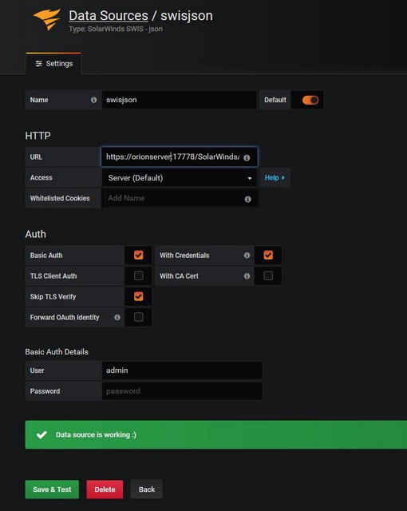

# SolarWinds SWIS DataSource based on Simple JSON Datasource

SWIS (SolarWinds Information Service) uses SWQL language - [learn more](https://github.com/solarwinds/OrionSDK/wiki/About-SWIS)

DataSource connects to SWIS HTTP REST endpoint. As URl specify SWIS HTTP endpoint address which is by default 
- https://orionservername:17778/SolarWinds/InformationService/v3/Json/

Unfortunately this endpoint doesn't support CORS so we can connect only via Server(default) 
and due to self-signed certificate we need to check option 'Skip TLS Verify'. Anonymous connection
 is not permited so you need to fill in your orion account credentials.
 
  


# SWIS query language
SWQL language is proprietal solarwinds query language to get data from all their data sources, [learn more](https://github.com/solarwinds/OrionSDK/wiki/About-SWIS)

## Time Series:
For time series data there are these conditions.
1. There has to be time column
2. There has to be string column to define metric name
3. There has to be value column(s), in case more columns are specified we will add suffix to metric name.
4. Data must be ordered by time

## Table:
- No restriction to data queries

Grafana macros available to use:
- $from - time interval start
- $to - time interval end
- $__interval - interval length for sampling 

## Time Sampling:
- For sampling you must use function downsample([timecolumn]). Sampling interval is used automaticaly from variable $__interval

## Variable queries:
- you need to define __text (manadatory) and __value columns:
``` sql 
  SELECT Caption as __text, NodeID as __value FROM Orion.Nodes
```
Variables are used in query via its name with prefix $. 
``` sql
  SELECT .... FROM ... WHERE .... AND NodeID IN ($Node)
```

## For annotation queries:
- you need to specify datetime column (mandatory) and then you can set text and tags columns
``` sql
  SELECT EventTime as time, Message as text, s.EventTypeProperties.Name as tags 
  FROM Orion.Events s WHERE EventTime BETWEEN $from AND $to
```

Example of query with time sampling to display CPUload and memory per node:
``` sql
SELECT
     downsample(ObservationTimeStamp) as time,
     a.Node.Caption,
     AVG(AvgLoad) as CpuLoad,
     AVG(AvgMemoryUsed) as MemoryUsed
FROM Orion.CPULoad a
WHERE ObservationTimeStamp BETWEEN $from AND $to
GROUP BY downsample(ObservationTimeStamp), a.Node.Caption, a.NodeID
ORDER BY time DESC
```
## Installation Manually
1. Download sources zip file. 
2. Extract the zip file into the data/plugins subdirectory for Grafana.
3. Restart the Grafana server
4. To make sure the plugin was installed, check the list of installed data sources.
